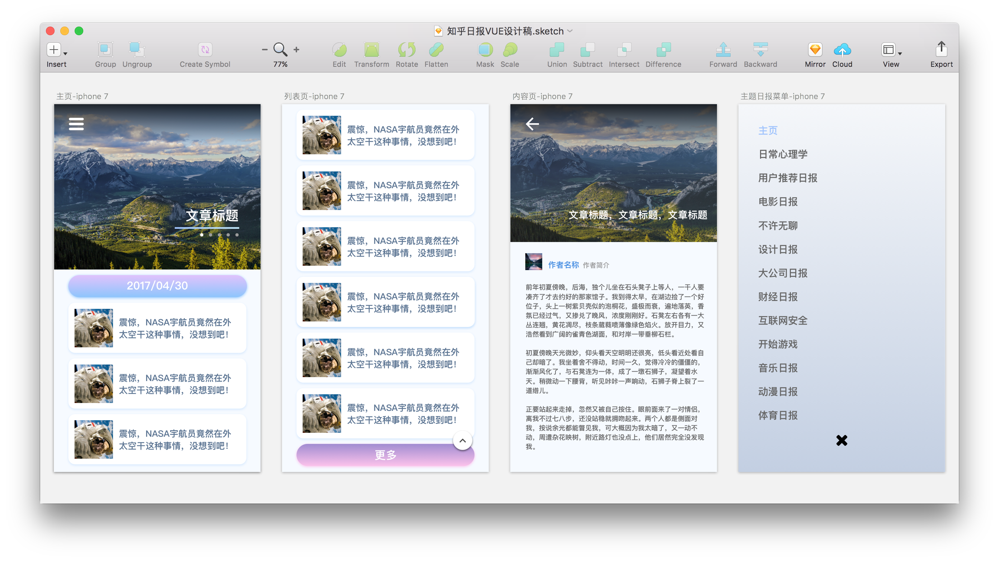

# 知乎日报 Vue.js

> 知乎日报 Web 版本，基于 Vue全家桶 开发。


## 声明

***本项目内所有文字图片等稿件内容均由 [知乎](https://www.zhihu.com/) 提供，获取与共享之行为或有侵犯知乎权益的嫌疑。若被告知需停止共享与使用，本人会及时删除整个项目。***

***请您了解相关情况，并遵守知乎协议。***

本项目仅供学习与交流使用！

大家多多交流，互相学习，写的不好的地方还请指正！

* 学习 Vue.js 一个多月, 也看了很多别人写的知乎日报, 然后就想着自己也设计做一版基于 Vue.js 的知乎日报。
* 该项目使用 [Vue-cli](https://github.com/vuejs/vue-cli) 构建、打包, 配合 [Vue](https://github.com/vuejs/vue) 全家桶（[Vue](https://github.com/vuejs/vue)、[Vuex](https://github.com/vuejs/vuex)、[Vue-router](https://github.com/vuejs/vue-router)）进行编码、使用 [Vue](https://github.com/vuejs/vue) 官方推荐的 [Axios](https://github.com/mzabriskie/axios) 进行数据请求

欢迎 Issue、Fork、Star ☺️🤑😁

## API

* 感谢 [Trevor](http://www.huangxizhou.com/) 同学提供的 [知乎日报 API（解决跨域精简版）](http://www.huangxizhou.com/2017/04/29/zhihu-dailyAPI/)
* 感谢 [知乎日报 API 分析](https://github.com/izzyleung/ZhihuDailyPurify/wiki/%E7%9F%A5%E4%B9%8E%E6%97%A5%E6%8A%A5-API-%E5%88%86%E6%9E%90)

## 技术栈

* [Vue 2.0](https://github.com/vuejs/vue) +  [Axios](https://github.com/mzabriskie/axios)  + [Vue-router](https://github.com/vuejs/vue-router) + [Vuex](https://github.com/vuejs/vuex)
* [Vue-awesome-swiper](https://github.com/surmon-china/vue-awesome-swiper)
* [Sass](https://github.com/sass/sass)

## Features

* 今日热门
* 每日日报
* 主题日报
* 文章详情

## Design

使用 sketch 设计页面, 照着自己喜欢的风格做了一版

## Demo
[Click me](https://vinsondragon.github.io/zhihuDaily/)

建议在手机下浏览，PC端打开F12手机模式食用更佳

## Build Setup 构建

``` bash
# install dependencies 安装依赖
npm install

# serve with hot reload at localhost:8080 运行项目
npm run dev

# build for production with minification 打包
npm run build

# build for production and view the bundle analyzer report
npm run build --report
```

## License

[MIT](https://opensource.org/licenses/MIT)

